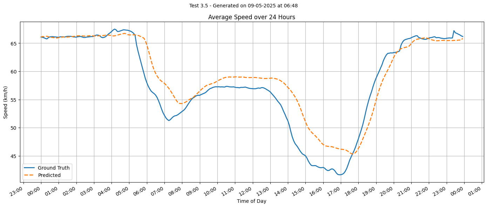
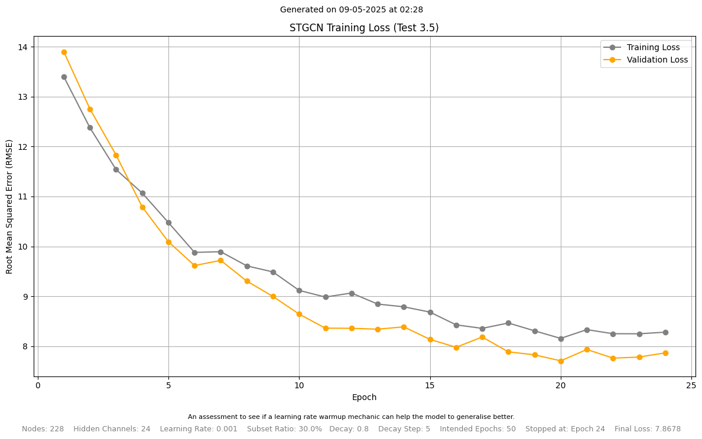
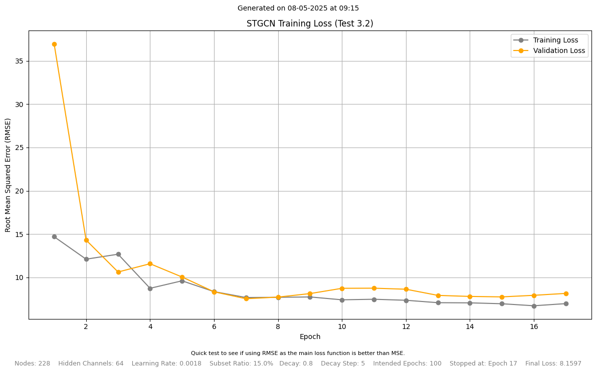
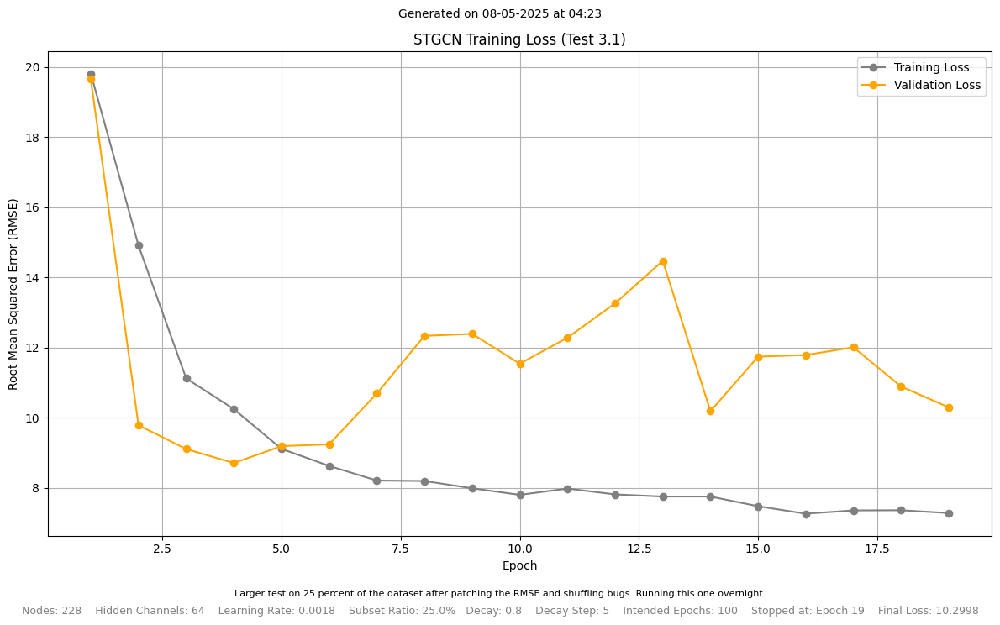
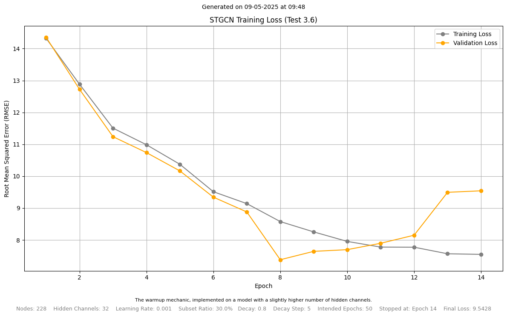

# COMP5013 PyTorch STGCN

A custom STGCN repository for COMP5013, built using PyTorch and, more specifically, PyTorch Geometric Temporal. The "legacy" directory contains the original code from the research paper, and that has been built in TensorFlow. It includes Attention Mechanisms and is experimental.

<p align="center">
  
</p>

## Table of Contents

- [Requirements](#requirements)
- [Original Paper](#original-paper)
- [Dataset](#dataset)
  - [Test Data Import](#test-data-import)
- [Hyperparameter Tuning Overview](#hyperparameter-tuning-overview)
  - [Subset Ratio](#subset-ratio)
  - [Learning Rate](#learning-rate)
  - [Gamma](#gamma)
  - [Step Size](#step-size)
  - [Warmup Epochs](#warmup-epochs)
  - [Hidden Channels](#hidden-channels)
  - [Epochs](#epochs)
  - [Patience](#patience)

## Requirements

This project has been built using Python of version `3.10.x`. It was built using the following packages:

- `torch==2.7.0`
- `torch-geometric==2.6.1`
- `torch_geometric_temporal==0.56.0`
- `numpy==2.2.5`
- `pandas==2.2.3`
- `scipy==1.15.2`
- `tqdm==4.67.1`
- `matplotlib==3.10.1`

These are also stored within the `requirements.txt` file. You can install them using the following command:

```bash
pip install -r requirements.txt
```

If you are using a virtual environment, make sure to activate it before running the above command. It's recommended to use a virtual environment to avoid conflicts with other projects, especially if you are using different versions of the same packages.

## Original Paper

The STGCN model we're building from was conceived by this research team in 2018.

> Bing Yu*, Haoteng Yin*, Zhanxing Zhu. [Spatio-temporal Graph Convolutional Networks: A Deep Learning Framework for Traffic Forecasting](https://www.ijcai.org/proceedings/2018/0505). In _Proceedings of the 27th International Joint Conference on Artificial Intelligence (IJCAI)_, 2018

## Dataset

**[PeMSD7](http://pems.dot.ca.gov/)** is the dataset used by the original research team, and the one used for this piece of work. It was collected from Caltrans Performance Measurement System (PeMS) in real-time by over 39,000 sensor stations, deployed across the major metropolitan areas of California state highway system. The dataset is aggregated into 5-minute intervals from 30-second data samples.

The team randomly selected a medium and a large scale among the District 7 of California containing 228 and 1,026 stations, labelled as PeMSD7(M) and PeMSD7(L), respectively, as data sources. The time range of PeMSD7 dataset is in the weekdays of May and June of 2012. Overall, there are 44 days of historical traffic speed data captured.

`PeMSD7_W_228.csv` is the adjacency matrix of the 228 sensors in the PeMSD7 dataset. The adjacency matrix is a 228x228 matrix, where each element represents the distance between two sensors. This matrix makes up the spatial element of the STGCN model, and can serve as a weighting matrix for the graph convolutional layers.

`PeMSD7_V_228.csv` is the traffic speed data of the 228 sensors in the PeMSD7 dataset. With 44 days of data, the dataset contains 44 x 24 x 12 = 12,672 samples. Each sample is a 228-dimensional vector, where each element represents the traffic speed of a sensor at a given time. This matrix makes up the temporal element of the STGCN model, and can serve as a feature matrix for the graph convolutional layers. Note that each row is a new record and each column is a sensor in the network.

For version control, the data files are compressed into a zip file. You will need to unzip those files with a tool of your choice (e.g. `unzip` on Linux or `7-Zip` on Windows) before running the code. Keep all data files are located in the `dataset` directory.

### Test Data Import

In order to test that the data has been unzipped and is able to be used correctly, run `test.py`. You should see the following output in your terminal:

```bash
Training set size: 10128
Testing set size: 1266
Validation set size: 1266
<class 'torch_geometric.data.data.Data'>
Data(x=[228, 12], edge_index=[2, 51722], edge_attr=[51722], y=[228, 1])
```

## Graphs

Here's a selection of validation loss graphs from the training runs. The graphs are saved in the `graphs` directory, and are named according to the date and time they were created. The format is `training_loss_<date>-<time>.png`.

<table align="center">
  <tr>
    <td></td>
    <td></td>
  </tr>
  <tr>
    <td></td>
    <td></td>
  </tr>
</table>

## Hyperparameter Tuning Overview

This section explores how each hyperparameter in the PyTorch model was assessed and tested. Most hyperparameters are set at the top of the `train_model.py` file in a section labelled “Options”. Each one is explained in more depth here.

### Subset Ratio

**Synopsis:** This is a decimal number indicating what proportion of the dataset should be split for training.  
**Example:** A value of `0.15` indicates 15% of the full dataset will be used for each epoch.

In each training attempt, it may not be desirable to test on the entire set. This could be for quick iteration on a smaller subset. It also simulates pseudo-mini-batching, especially valuable during early prototyping on limited hardware. A value between `0.3` and `0.4` offered substantial time savings while still providing a varied and useful subset.

---

### Learning Rate

**Synopsis:** Learning rate for the optimiser, which controls how aggressively the model corrects for mistakes.  
**Example:** Typical values start at `0.001` but can be lower for more control or higher for more aggressive updates.

A value of `0.001` was found to be effective, balancing learning speed and stability. Larger values caused the model to overcorrect, reducing long-term performance. When warmup was introduced, this value served only as the base rate for linear decay and no longer directly affected learning at the start.

---

### Gamma

**Synopsis:** A multiplier for learning rate decay. Lower values cause the learning rate to decay more rapidly.  
**Example:** A value of `0.8` reduces the learning rate at a gradual and comfortable pace.

Gamma affects both warmup and linear decay strategies. Values below `1` slow the rate of learning. While some research favours `0.7`, this project found `0.8` to be the best compromise for learning stability and efficiency.

---

### Step Size

**Synopsis:** The interval of linear learning rate decay; after how many epochs should learning rate decrease.  
**Example:** A value of `5` means that learning rate drops every 5 epochs.

Before the adoption of warmup, this value determined how often the learning rate reduced. A step size of `4–5` proved to be effective for steady learning without premature stagnation.

---

### Warmup Epochs

**Synopsis:** The number of epochs for the learning rate to peak at the start of training.  
**Example:** `5` epochs means it takes 5 epochs before the learning rate reaches its maximum.

Warmup was added late in the project. Even with limited experimentation, setting this to `5` yielded immediate and measurable improvements.

---

### Hidden Channels

**Synopsis:** The number of hidden channels that the STGCN should employ.  
**Example:** Values like `24` or `32` offer a good trade-off between performance and overfitting.

This setting controls the size of the message-passing blocks within each STConv block. Increasing this value boosts model capacity but risks overfitting. `24` and `32` performed well, keeping inference time reasonable while maintaining prediction accuracy.

---

### Epochs

**Synopsis:** The number of training passes the model completes before finishing training.  
**Example:** `50` epochs means 50 training passes are attempted.

With early stopping enabled, this number became more of an upper bound. For quick daytime experimentation, `50` was common. Overnight runs might use higher values, while prototypes could use less.

---

### Patience

**Synopsis:** How many epochs the early stopping mechanism permits without seeing improvement before killing the training loop.  
**Example:** A value of `4` means that after 4 epochs of negligible improvement, training stops.

A patience setting of `5–8` worked well. While quick to halt on stagnation, this range still allowed enough time for the model to recover and improve if performance fluctuated slightly.

---
